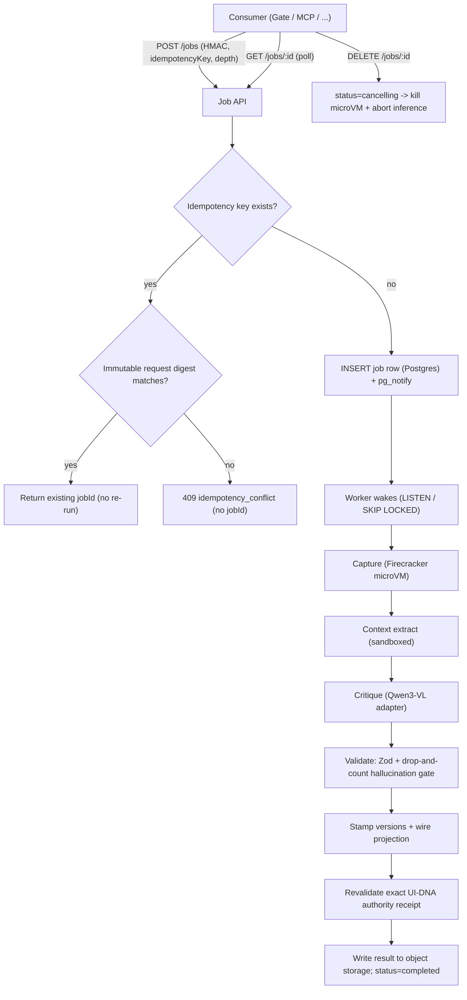
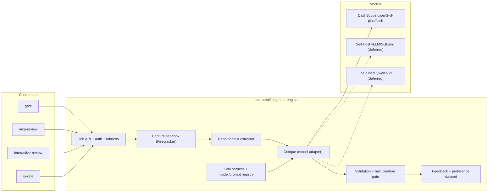
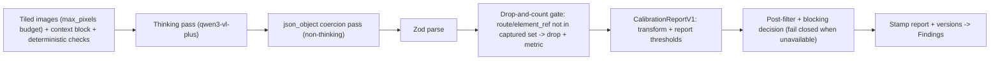
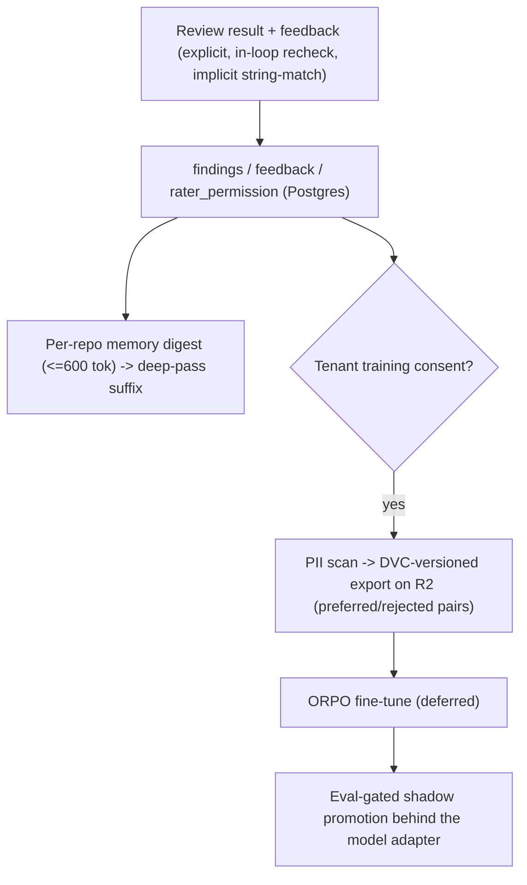

# Apature Judgment Engine Architecture

Created: 2026-06-16
Status: architecture record (decisions E1–E6 applied)

## 1. Architecture Summary

Judgment Engine is the shared, multi-consumer substrate behind Apature's product surfaces (Gate, MCP Review, UI DNA, and others). It accepts a review job, captures the rendered UI deterministically, extracts repo context, runs grounded Qwen3-VL critique, validates findings, records feedback, and returns a versioned result. It is not buyer-facing.

Two principles drive the design:

- **Trust over cleverness.** A screenshot of a half-loaded page or a hallucinated finding ends an install. Determinism in capture and a drop-and-count validation gate are load-bearing, not polish.
- **Grounding and labeled feedback, not the model call, produce the verdict.** Every review is instrumented to produce a clean labeled preference tuple, and the engine is built so the default judge can later become a fine-tuned Qwen3-VL behind the same adapter.

## 2. Job Lifecycle

Consumers never call a blocking function over the network. They submit an asynchronous job and poll. (Decision E1.)

- **Job store:** Postgres jobs table; workers wake via `pg_notify` and claim with `SELECT ... FOR UPDATE SKIP LOCKED`. Results live in object storage; status/metadata in Postgres. Redis is used only for token-buckets and quotas, not as the job store (avoids a two-store sync problem).
- **Idempotency key:** `{consumer}:{installationId}:{intentType}:{intentHash}`
  remains a caller-owned opaque key. `INSERT ... ON CONFLICT DO NOTHING` is the
  ACID linearization point; an existing job is returned only when its persisted
  `judgment-engine/job-submission/v1` digest exactly matches the canonical
  immutable consumer, verified installation, intent, depth, opaque key, and
  request. A mismatch is a non-enumerating 409 with no existing job id (#178).
- **Cancellation:** `DELETE /jobs/:id` writes `status=cancelling` immediately (consumers see intent at once), then tears down the in-flight Firecracker microVM and aborts the inference stream within one heartbeat (~5s). Cooperative, not preemptive; correctness never depends on the kill landing in time.
- **Auth & versioning:** every request is HMAC-signed and scoped to `installationId`; every result carries an `x-schema-version` header and `{engineVersion, model, promptVersion, captureVersion}` metadata.

## 3. System Boundaries

The stable contract is `critique(images, context) -> Findings`, exposed through the async job API. All model backends sit behind one adapter so DashScope, self-host vLLM, and a future fine-tuned checkpoint are swappable per-pass without touching consumers.

## 4. Capture Sandbox (Decision E3)

Capture runs in a **Firecracker microVM per job on Fly Machines** — built, not bought. Hostile PR code executes in the capturing browser, so KVM-grade isolation is a hard requirement, and the egress/SSRF policy must be enforceable at the network layer — neither is possible on a managed browser vendor that also sees customer PII screenshots. (Resolves the #23 build-vs-buy spike: BUILD.)

- **Egress:** two layers — `nftables` in the guest network namespace (deny RFC-1918 / link-local `169.254.0.0/16` / metadata / `::1`; allow public assets with caps) as the primary control, plus Playwright-level DNS re-resolution to defeat rebinding.
- **storageState:** KMS-decrypted inside the microVM only, origin-scoped, disabled on fork PRs.
- **Latency:** cold-start Firecracker + Chromium at MVP; a warm-pool manager is the deferred lever for the latency budget at scale (#77). Restore via Fly's **per-machine suspend/resume (1:1, ~hundreds of ms)** is the recommended default — cloning one golden snapshot across concurrent hostile-PR sandboxes is documented-insecure (entropy/RNG/token reuse) without VMGenID/VMClock reseeding. See TRD §4 (2026-06-21 research note). The 120s wall clock is per page-capture; jobs fan out across microVMs.
- **Reversibility & residency:** everything sits behind `captureInSandbox(url, ctx)`; the enterprise in-VPC path runs the same sandbox in the customer cloud so screenshots never leave it.

## 5. Capture Trust Protocol (Decision E4)

Determinism is the anti-hallucination foundation:

- `domcontentloaded` then explicit readiness signals; never `networkidle` as arbiter; wait for fonts; freeze animations + reduced motion (re-inject after scroll); scroll once for lazy-load.
- **Stability:** perceptual-hash stability gate plus a structural-diff hash (free, orthogonal), excluding known-animated regions.
- **Confidence custody:** capture emits an instability fact, never a numeric policy. A matching promoted `CalibrationReportV1` transforms raw confidence and supplies the instability/post-filter/blocking thresholds. Missing or mismatched evidence withholds confidence and disables blocking.

## 6. Critique & Validation Pipeline (Decisions E2, E4)

- **Structured output:** DashScope is a two-step path (Thinking critique → non-thinking `json_object` coercion → Zod) because thinking and JSON mode are mutually exclusive and `max_tokens` cannot be set with `json_object`. Self-host uses single-call guided decoding (SGLang + XGrammar) — the better path, deferred. SGLang is the primary self-host recommendation: RadixAttention prefix reuse fits the byte-identical context block, and SGLang overlaps grammar-mask generation with inference so guided decoding stays cheap (vLLM degrades at batch >=8). See TRD §7 (2026-06-20 research note, #76).
- **Image budget:** Qwen3-VL patch-16 + `min_pixels`/`max_pixels` (not Claude's `⌈w/28⌉`/2576px/4784-token constants); `max_pixels` enforced in the adapter and is the cost lever. Prefix caching keyed on the byte-identical context block.
- **Hallucination gate:** findings whose `route`/`element_ref` are not in the captured set / DOM geometry map are dropped and counted; the drop rate is an SLO that feeds eval.
- **Publication authority (added July 14, 2026; #175):** a grounded review is not
  publishable merely because its genome resolved as effective. Source of Truth
  returns the exact DNA version plus UI-DNA's monotonic sequence/head/freshness
  receipt; the runtime carries that receipt through capture and inference, then
  performs a separately authorized tenant/repository/version recheck in the Job API's single
  pre-persistence hook. `revoked` suppresses blocking. Missing, malformed, stale,
  unavailable, conflicting, or regressed evidence becomes `unknown` and also
  suppresses blocking. Findings remain intact, while the governing receipt and
  publication check time are stamped in result metadata. UI-DNA is the sole
  authority; Judgment Engine never writes authority or customer code.

## 7. Feedback & Learning Pipeline (Decision E5)

- Storage/versioning: Postgres + a **DVC-versioned export on the existing R2** for reproducible, point-in-time training sets with lineage (finding → verdict → screenshot). No new infra.
- Label quality: rater-permission weighting, collaborator-vs-drive-by down-weighting, the in-loop recheck auto-label (densest, cleanest signal), suggestion string-match as the only implicit positive. Link-unfurlers and "touched the element" never count.
- Governance: screenshots are PII — explicit tenant **training consent** + a PII scan gate what may enter a cross-tenant training set. Per-repo memory ships now (immediate personalization); the fine-tuned judge is the deferred compounding asset behind the same adapter. Per-tenant LoRA is deferred.

## 8. Capacity, Promotion & Observability (Decision E6)

- **Capacity & fairness:** a global Redis token-bucket on the model endpoint (outer envelope) + a per-`installationId` quota + priority queues (gate-blocking > gate-background > other consumers), so one tenant's PR burst cannot starve others. Backpressure surfaces as `429 + Retry-After` to consumers' circuit breakers.
- **Eval-gated promotion:** a `model_prompt_registry` (Postgres) records every model/prompt version; CI on any prompt/model change runs the offline batch eval on the **frozen, content-addressed capture set** and **blocks merge on eval-fail**; rollback is a registry status flip. Shadow/canary rollout is deferred. No prompt or model reaches production without a version bump + eval pass — this is also what keeps the preference dataset uncontaminated across prompt generations.
- **Version stamping:** every `Findings` result carries `{engineVersion, model, promptVersion, captureVersion}` — the stable interface consumers (Gate) depend on, and the lineage key for the dataset.
- **SLOs:** end-to-end critique latency (p50/p95), hallucination-drop rate, capture-instability rate, queue backpressure, model-rate-limit incidents, eval precision/recall by dimension. Emitted via OpenTelemetry to Grafana.

## 9. Failure Modes

| Failure | Engine behavior |
|---|---|
| Exact retry (same idempotency key + request digest) | Return the existing jobId; never re-run capture |
| Reused idempotency key with another request | Non-enumerating `409 idempotency_conflict`; never return the existing jobId |
| Cancellation requested | `status=cancelling` immediately; tear down microVM + abort inference within a heartbeat |
| Capture unstable | Apply the confidence ceiling; mark the page unstable in the result |
| Hostile PR code attempts internal egress | Denied by nftables; DNS-rebind defeated by re-resolution |
| Model returns invalid/malformed JSON | Zod-parse fails → bounded retry; never emit a partial |
| Finding references unknown route/element_ref | Drop + increment hallucination-drop metric |
| Model endpoint 429/throttle | Global token-bucket + per-tenant quota backpressure; surface `429 + Retry-After` |
| Prompt/model change fails eval | CI blocks the merge; production stays on the last registry-stable version |
| Tenant withholds training consent | Data used for per-repo memory only; excluded from cross-tenant training export |

## 10. Architecture Decision Log

| # | Decision | MVP | Migrate to | Trigger |
|---|---|---|---|---|
| E1 | Job API + store | Postgres jobs + `pg_notify` + cooperative cancel | completion-webhook callback; Temporal | poll volume / pipeline complexity |
| E2 | Model serving | DashScope-only behind adapter (two-step JSON) | self-host vLLM (guided decoding) → fine-tuned | GPU utilization vs managed-endpoint cost; residency need |
| E3 | Capture isolation | BUILD Firecracker-on-Fly cold-start + nftables | warm-pool (snapshot/UFFD); in-VPC | latency budget at scale; enterprise |
| E4 | Output & trust | two-step + drop-and-count + phash/structural-diff + confidence ceiling | json_schema coercion; conditional re-ask | DashScope json_schema GA; precision need |
| E5 | Feedback dataset | DVC export on R2 + consent/PII gate; per-repo memory | ORPO fine-tune → per-tenant LoRA | dataset volume |
| E6 | Capacity & promotion | token-bucket + per-tenant quota + priority queues; registry + CI eval-gate + version stamping | shadow/canary rollout; artifact registry | consumer count; model-change cadence |

Hard invariants across every migration: no `contents: write`; the model judges, never edits/drives; deterministic-capture trust; drop-and-count for unknown route/element_ref; screenshots are PII; SSRF/egress/DNS-rebind controls mandatory; Apature manages model serving by default (no BYOK) — enterprise residency is the in-VPC self-host path.
